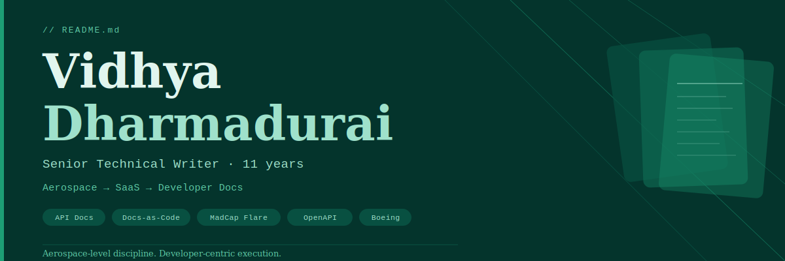

<!-- Banner -->

<!-- Stats row -->

<!-- Streak stats -->

# Hi, I'm Vidhya Dharmadurai 👋

**Senior Technical Writer · 11 years · Aerospace → SaaS → Developer Docs**

✉️ dvidhya93@gmail.com | [LinkedIn](www.linkedin.com/in/vidhya-dharmadurai-03375764)

---

Technical Writer with 11 years of experience across aviation and SaaS — from aircraft maintenance manuals for Boeing 737 MAX to API references and developer guides for web-based platforms. I specialise in simplifying complex technical content for diverse audiences, with a strong focus on Docs-as-Code, structured authoring, and developer experience.

---

## 💼 Work Experience

**Senior Technical Writer** — Boeing India Pvt Ltd *(Jun 2025 – Present)*
- Authoring User Guides and Admin Guides for Boeing's Maintenance Performance Toolbox in MadCap Flare (MSTP standards)
- Publishing Release Notes in Confluence, collaborating with developers and QA in Agile sprints
- Maintaining version control via Git/GitHub for documentation traceability
- Self-initiated API Documentation Portfolio — REST API references, Getting Started Guides, and Release Notes on GitHub

**Technical Writer** — Boeing India Pvt Ltd *(Dec 2017 – May 2025)*
- Developed and revised AMMs for Boeing 737 MAX, 737 NG, 747, 777, and 787
- Dual role as Author and Illustrator for AMM Chapters 11 & 31 (Flight Deck Instruments)
- Collaborated with US-based cross-functional teams and SMEs to validate technical accuracy

**Technical Writer** — Capgemini Business Services Ltd *(May 2015 – Nov 2017)*
- Created and revised AMM procedures based on engineering orders and service bulletins

---

## 📁 Portfolio Projects

| Project | Type | Tags |
|---------|------|------|
| Weather API & Scan API | REST API Reference + Release Notes | `OpenAPI` `Swagger` `REST API` |
| Booking.com — Getting Started Guide | Developer Onboarding | `Developer Docs` `DX Writing` |
| Booking.com — User Guide | End-user Documentation | `User Guide` `Structured Authoring` |

---

## 🎯 Core Focus Areas

- 📄 API documentation (REST, OpenAPI/Swagger)
- 🔧 Docs-as-Code (GitHub, Markdown, Docusaurus, MkDocs)
- 🔁 CI/CD-integrated documentation workflows
- 🖥️ Developer portals & UX writing for DX
- 🤖 AI-assisted documentation workflows

---

## 🛠️ Tools & Stack

**Documentation:** `MadCap Flare` `Arbortext Epic Editor` `Confluence` `Markdown` `OpenAPI` `Swagger` `JSON` `YAML` `Postman` `MkDocs` `Docusaurus`

**Methods:** `SDLC` `DDLC` `Agile Scrum` `DITA` `Structured Authoring` `Docs-as-Code`

**Version Control & CMS:** `GitHub` `Git` `SharePoint` `Jira`

**Diagramming:** `draw.io` `MS Visio` `Snagit`

---

## 🎓 Education

**B.E. Aeronautical Engineering** — Anna University, Chennai *(2010–2014)* · GPA: 8.0/10.0

---

*Aerospace-level discipline. Developer-centric execution. 11 years of docs that actually get read.*

## Skills Demonstrated
- [Weather API documentation](weather-api\weather-api.md)
- [Booking.com-Getting Started Guide](Getting started Guide - Booking.com.pdf)
- [Flow chart](DDLC.jpg)
- Docs-as-code (Markdown)
- Prompt engineering for documentation
- Handling ambiguous requirements
